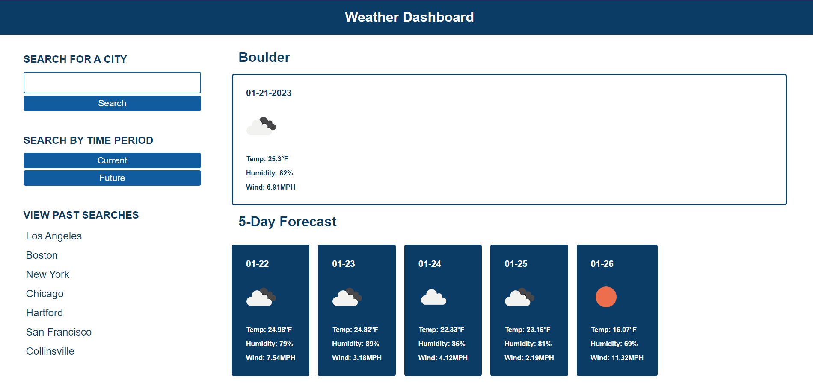
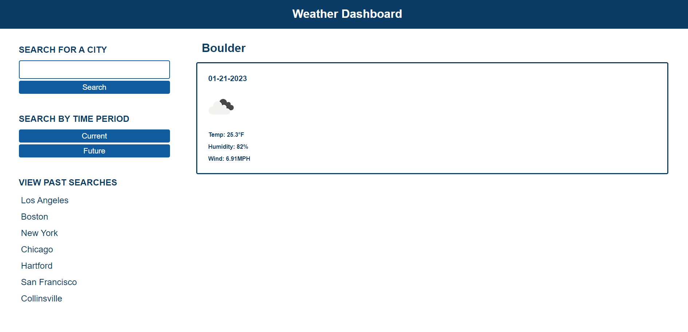
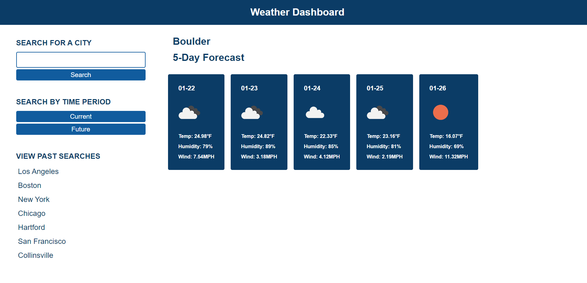

# weather-forecast

## Description
My weather dashboard runs in the browser and features dynamically updated HTML and CSS. I used the [5 Day Weather Forecast](https://openweathermap.org/forecast5) to retrieve weather data for cities. Users can search for a city then select whether they want to see current or future weather or see both by not selecting either time option. I used `localStorage` to store past search results so that users can easily view their past searches on the lefthand side and click on them to see the weather again.

## Mock-Up
The following images show the web application's appearance and functionality.

If neither current or future is selected, both time periods will display.

If current is selected, then the current day's weather will display.

If future is selected, then a five day forecast will display.

## Link